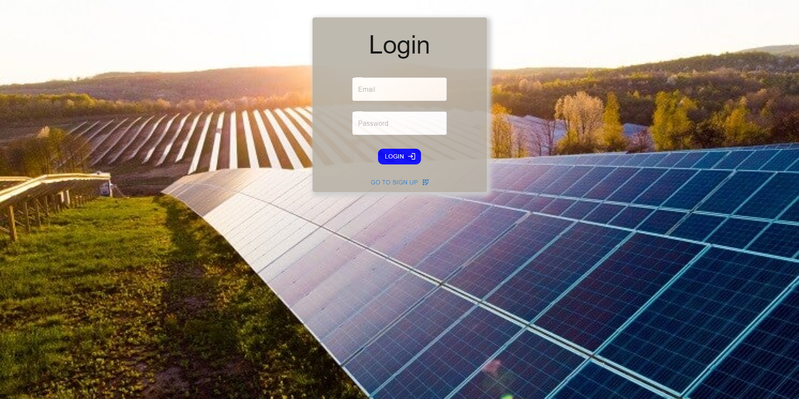
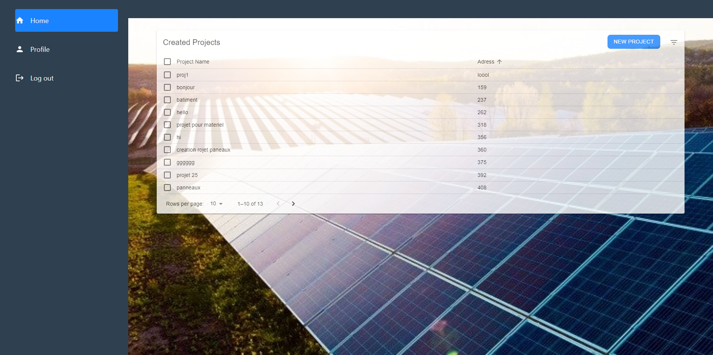
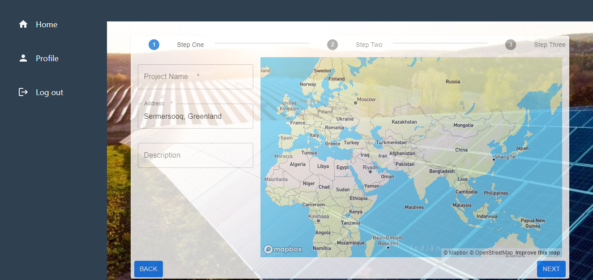

# CalculateurFrontend

This react app project comprises of a website that guides you through the process of configuring your solar panel installation at home, including address selection, terrain selection, material selection, and the ability to personalize the right locations for your solar panels. 


## Table of content

* [Installation](#installation)

* [Usage](#usage)

* [Features](#features)

* [API Documentation](#api-documentation)

* [Contact Information](#contact-information)

* [Aknowledgments](#acknowledgments)


## Installation

1. Clone the repository: 

```
$ git clone https://github.com/KhRania/CalculateurFrontend
```
2. Install dependencies: 

```
$ cd frontend
$ npm install
```

3. Enter your Mapbox API key in `Step1.js`: 

```
mapboxgl.accessToken ='YOUR_KEY_HERE'
```
_note: you must create a Mapbox account to get the API key_


## Usage

1. Access the `frontend` folder: 

```
$ cd frontend
```
2. Run the development server: 

```
$ npm start
```

3. Open the project in your browser at:
`http://localhost:3000`

4. Authenticate by writing an email and a password.



5. After authentication you will be redirected to a main page where you can visulaize your previous projects or you can create a new porject by clicking on the create project button.



6. Once the previous step is done , fill in the blanks the necessary information then click on next to move to the next step . It is possible also to backtrack steps and add necessary modifications.



7. Once all the steps are done , click on finish and that will automotically save your project and you will be able to visualize , delete or edit it in the home page.

8. Once you are done click on "Log out" on the side bar to exit the authentication page.

_you can also consult your profile by click on "profile" on the side bar and edit your information._

## Features

### Material UI

Material-UI is a popular open-source library for building user interfaces in React applications. It provides a set of pre-designed and customizable UI components that follow the Material Design guidelines created by Google. Material-UI allows developers to create modern and visually appealing UIs with ease.

**Documentation :** https://mui.com/material-ui/getting-started/overview/

Some components used in this project : Stepper, Step, Steplabel, Box, Textfield, Paper, Typography, MUI icons, button .

### React Router 

React Router is a popular routing library for React applications. It allows you to handle routing and navigation in a declarative way, enabling you to create single-page applications (SPAs) with multiple views or pages.

React Router provides a set of components that enable you to define routes and their corresponding components, and it ensures that the correct component is rendered based on the current URL. It also provides features like nested routes, route parameters, and query parameters.

**Documentation :** https://reactrouter.com/en/main

#### Implementation 

* We wrapped the App component in the `index.js` file with the necessary Router type.

```
const root = ReactDOM.createRoot(document.getElementById('root'));
root.render(
  <React.StrictMode>
    <BrowserRouter>
    <App />
    </BrowserRouter>
  </React.StrictMode>
); 
````
* We then imported 'react-router-dom' in App.js and wrapped the components inside Routes as follows :


## API Documentation

### Mapbox Geocoding API 

We used the Mapbox Geocoding API to allow the user to find his address by writing it or locating it on the map.

**Documentation :**  https://docs.mapbox.com/api/search/geocoding/

### Leaflet API

Leaflet is the leading open-source JavaScript library for mobile-friendly interactive maps. Weighing just about 42 KB of JS, it has all the mapping features most developers ever need.

Leaflet is designed with simplicity, performance and usability in mind. It works efficiently across all major desktop and mobile platforms, can be extended with lots of plugins, has a beautiful, easy to use and well-documented API and a simple, readable source code that is a joy to contribute to.

We have used the GEOjson component from leaflet to allow us to trace outlines using json files for different countries and seperate countries by regions , we used this component also to create legends for the map and costomization .

**Documentation:** https://leafletjs.com/reference.html

## Contact Information

Email : hedi.makhlouf@ensi-uma.tn

## Acknowledgments 
